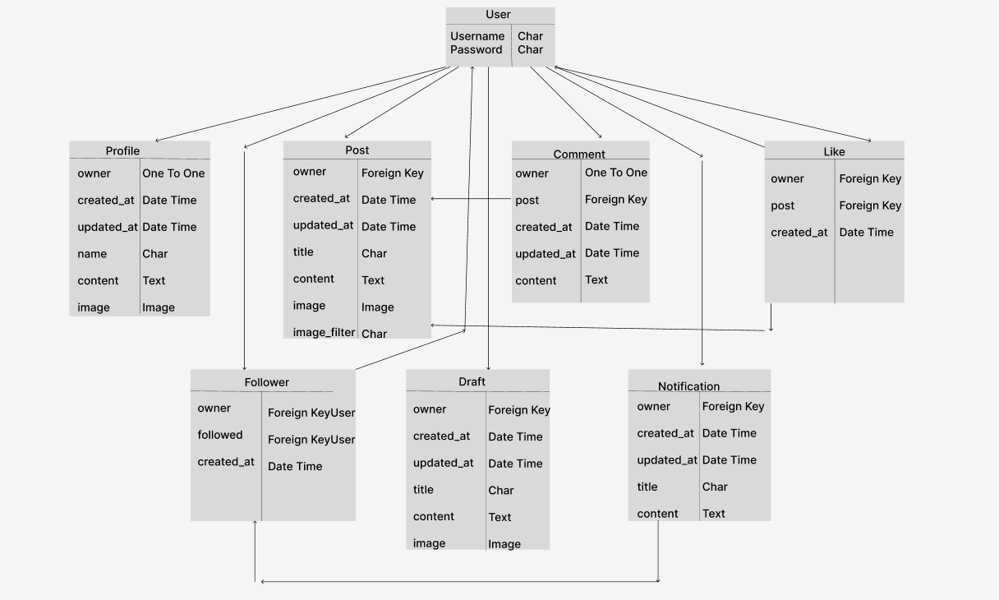

MYFXLIFE-API is a backend application built so support the needs of our frontend application (myfxlife). In this application a database is setup where users can upload information using the front end and it will be saved. Users will also be able to request data and it will be sent to them if they are authenticated to view or edit requested data. 

## Entity Relationship Diagram

## Project Goals

### Owner Goals

1. Users should be able to have access to resources they request if they fulfill the permissions granted for the requested resources.

2. If a user does not have permissions(maybe becaused he is not authenticated), then he can only have read access to some resources.

### User Gaols

1. If a user is authenticated he should be able to have access to all resources except editing objects he does not own.

2. A user should be able get detail access to an object by using the object id.

## Security:

From the walkthrough project read access has been granted to unauthenticated users. I find this particularly not the best as other users data
is being accessed by unknown users of the application. So I created two extra resourcesm(Drafts and Notifications) and granted only IsAuthenticated permissions. I think this is what should be done even for the other resources. But for the sake of the project I followed what was done in the walkthrough project.

## Resources and Permission Levels

<table>
    <tr>
        <th>Resource</th>
        <th>Authenticated User</th>
        <th>Unauthenticated User</th>
    </tr>
    <tr>
        <td>Profiles</td>
        <td>List all profiles and edit profile he/she owns</td>
        <td>List all profiles but can not edit a profile</td>
    </tr>
    <tr>
        <td>Posts</td>
        <td>Create and List all posts and edit posts he/she owns</td>
        <td>List all posts but can not edit a post</td>
    </tr>
    <tr>
        <td>Comments</td>
        <td>Comment on post, View all comments, delete and edit comments </td>
        <td>View comments only</td>
    </tr>
    <tr>
        <td>Follower</td>
        <td>List followers and can follow</td>
        <td>List followers but can not follow</td>
    </tr>
    <tr>
        <td>Likes</td>
        <td>List all likes, create and delete likes</td>
        <td>List likes but cannot create like</td>
    </tr>
    <tr>
        <td>Draft</td>
        <td>Can view drafts he owns but not drafts of other users</td>
        <td>Can not view any draft</td>
    </tr>
    <tr>
        <td>Notfications</td>
        <td>Can view notifications he owns but not that of thers except he is following their profiles</td>
        <td>Can not view any notification</td>
    </tr>
</table>

<strong>Drafts are so that users could make as many post as they want but not publish immediately. Notifications were intended to make users send particular information only to users following them.</strong>

## Testing

<table>
    <tr>
        <th>Activity</th>
        <th>Expected Results</th>
        <th>Atual Results</th>
    </tr>
    <tr>
        <td>View Profile user owns by its id</td>
        <td>Form to edit profile is displayed</td>
        <td>Pass</td>
    </tr>
    <tr>
        <td>View Profile user does not own by its id</td>
        <td>Form to edit profile is not displayed and user can edit profile</td>
        <td>Pass</td>
    </tr>
    <tr>
        <td>View a post user owns by id</td>
        <td>Form to edit post is displayed and user can edit the post</td>
        <td>Pass</td>
    </tr>
    <tr>
        <td>View a post user does not own by it id</td>
        <td>Form to edit post is not displayed does user can not edit the post</td>
        <td>Pass</td>
    </tr>
    <tr>
        <td>View a comment user owns by its id</td>
        <td>Form to edit comment is displayed</td>
        <td>Pass</td>
    </tr>
    <tr>
        <td>View a comment user does not own by its id</td>
        <td>Form to edit comment is not displayed</td>
        <td>Pass</td>
    </tr>
    <tr>
        <td>Login and input draft url</td>
        <td>Owners drafts are listed</td>
        <td>Pass</td>
    </tr>
    <tr>
        <td>Logout and input drafts url</td>
        <td>No drafts are listed</td>
        <td>Pass</td>
    </tr>
</table>

## Deployment

This application was deployed on Heroku. Below are the steps taken to successfully deploy.

1. Create a database with ElephantSQL. The process involves signing up and  login in to the website, then creating a "New Instance". Setup the Instance and then at the end we obtain a database URL.

2. Install Database and psycopg2 in the application with command "pip3 install dj_database_url==0.5.0 psycopg2"

3. Add enviromental variables like the database url, our cloudinary url, and a secret key in the 'env.py' file import them into the settings file for security then setup the database. At the end you make the migrations and then migrate.

4. Then again in the terminal we install gunicorn "pip3 install gunicorn django-cors-headers" and update requirements.txt file.

5. To be able to have the frontend and backend deployed in separate platforms we set JWT_AUTH_SAMESITE to None.

6. To confirm are requirements file is up to date we run command "pip freeze --local > requirements.txt" in the terminal and if all is good we commit and push to Github.

7. Goto Heroku. In Heroku a new app was created, a region chosen and then under settings we add some config variables i.e Cloudinary URL, Database URL, Secret Key, Client Origin, Client Origin Dev, Allowed Host then also Set Disablecollecstatic to 1.

8. After we head to deploy tab, connect the app to our github repository and deploy in main branch. The app was successfully deployed to heroku and live Link is: 

N.B. 
This application does not automatically deploy so each time the developer makes changes they have to come and deploy manually.

9. The app was successfully deployed to heroku and live Link is: <https://myfxlifeapi-66a11d885add.herokuapp.com/>

## Credits

- Deployment

Thanks to Code Institute's Tutor support for assistance during deployment.

- Media

All images on the readme file itself are screenshots demonstrating different parts of the application. 

We created our entity relationship diagram using [Figma](https://www.figma.com/)

- Code

Thanks to Code Institutes walkthrough project we got a lot of boiler plate code and used it to feet our requirements.

Learned a lot from free content on the internet like [Stack Overflow](https://stackoverflow.com/) 

Special thanks goes to my mentor, and thanks also to the Code Institute tutors and the CI Slack Channel for support.